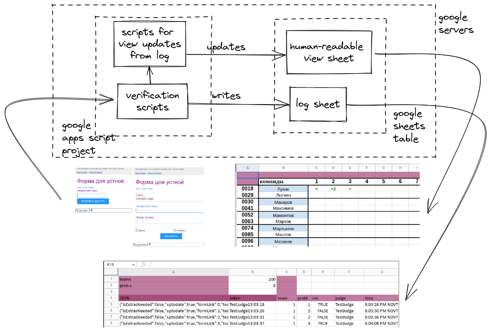

# MathGamesScripts

Система для упрощения проведения и судейства турниров математических игр.  
Применялась в 2018-19 годах на нескольких турнирах и двух Устных Олимпиадах, пока автор не окончил школу и поддержку системы.

## Архитектура:

## Подробное описание:

### Предметная область: 
* соревнование по решению математических задач
* проверка каждой задачи фиксируется в общем протоколе и на условиях задачи
* несколько судей, > 10 участников
* при большом масштабе фиксируется метаинформация - фио судьи, время отметки
* необходимость видеть текущий прогресс всех участников в реальном (~минуты) времени
* после конца соревнования соревнования проводится сверка результатов проверок в протоколе и на условиях
### Проблемы
* на сверку требуется больше времени и судей, чем хотелось бы
* при большом количестве судей тяжело масштабировать бумажные протоколы, либо 1 вносящего в таблицу судью
* метаинформация может быть неточной либо отсутствовать
### Решение
* внесение через веб-форму решает проблему 2
* последовательный лог в таблице упрощает сверку и поиск по ней
* автоматическая запись метаинформации (время, судья)

Site: https://sites.google.com/view/mathgamesscripts
Current spreadsheet: https://goo.gl/uuFHWW
